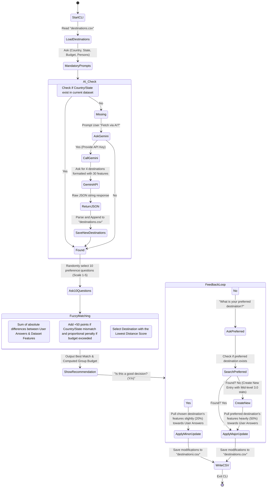

# Travel Decision Companion - Architecture & Data Flow

## 1. System Architecture

### System Workflow

1. User interacts via CLI  
2. Preferences collected using Inquirer  
3. Fuzzy Engine evaluates dataset  
4. Constraints applied  
5. Best destination searched  
6. If missing → Gemini generates new destination  
7. Results shown using Chalk + Ora  
8. Feedback collected  
9. Learning module updates dataset  
10. CSV file permanently updated  

## System Process Explanation

1. **User interacts via CLI**
   - The system starts through the Command Line Interface.
   - The user initiates the travel decision process.
   - Interaction happens completely inside the terminal.
2. **Preferences collected using Inquirer**
   - The system asks interactive questions.
   - User provides inputs such as budget, adventure level, relaxation preference, nature interest, etc.
   - These responses become decision parameters.
3. **Fuzzy Engine evaluates dataset**
   - User inputs are converted into fuzzy values (low, medium, high).
   - The engine compares user preferences with destination features.
   - Each destination receives a suitability score.
4. **Constraints applied**
   - Mandatory conditions are checked.
   - Destinations violating rules (budget limit, required feature absence) receive penalties.
   - Invalid options are filtered or downgraded.
5. **Best destination searched**
   - The engine ranks all destinations based on final fuzzy scores.
   - The highest matching destination is selected.
6. **If missing → Gemini generates new destination**
   - If no suitable match exists in the dataset,
   - The system sends a request to Gemini AI.
   - Gemini dynamically generates a new travel destination with required attributes.
7. **Results shown using Chalk + Ora**
   - Ora displays loading animations while processing.
   - Chalk formats output using colors and highlights.
   - Recommended destination is presented clearly to the user.
8. **Feedback collected**
   - User confirms whether the recommendation is satisfactory.
   - Acceptance or rejection feedback is recorded.
9. **Learning module updates dataset**
   - The system adjusts feature weights based on feedback.
   - Preference importance is refined for future decisions.
10. **CSV file permanently updated**
   - Updated values and newly generated destinations are saved.
   - The dataset evolves over time, improving recommendation accuracy.

## 2. Data Flow Diagram

This diagram visualizes how the system processes user inputs, performs the fuzzy logic matching, generates new data dynamically using AI, and learns from user feedback.

## 2. Data Flow Diagram – Process Explanation

This diagram explains how data moves through the system from user interaction
to intelligent decision making and adaptive learning.

### 1. System Initialization (StartCLI)
- The application starts through the Command Line Interface.
- User launches the travel decision companion.
- System prepares required modules and dataset access.

### 2. Load Existing Dataset
- The system reads `destinations.csv`.
- All stored travel destinations and their feature values are loaded.
- Data becomes available for comparison and matching.

### 3. Mandatory User Inputs
- The system collects essential information:
  - Country
  - State
  - Budget
  - Number of persons
- These inputs act as mandatory filtering conditions.

### 4. AI Location Availability Check (AI_Check)

#### Location Verification
- System checks whether the entered Country/State exists
  in the current dataset.

#### Case 1: Location Found
- The system proceeds directly to preference questioning.

#### Case 2: Location Missing
- User is asked whether new destinations should be fetched using AI.

##### If User Selects YES:
1. Gemini API is called.
2. AI generates **10 new destinations**.
3. Each destination contains around **30 feature attributes**.
4. Response is received as structured JSON.
5. JSON data is parsed.
6. New destinations are appended to `destinations.csv`.

##### If User Selects NO:
- System continues using existing dataset only.

### 5. Preference Question Phase
- System randomly selects **10 preference questions**.
- Questions use a rating scale from **1 to 5**.
- Examples:
  - Adventure preference
  - Relaxation level
  - Cultural interest
  - Nature focus
- Answers form the fuzzy input vector.

### 6. Fuzzy Matching Process

#### a) Distance Calculation
- System compares:
  - User preference values
  - Destination feature values
- Absolute difference is calculated for each feature.
- Differences are summed to produce a **distance score**.

Lower distance → Better match.

#### b) Penalty Application
Additional penalties are added when:
- Country or state mismatches (+50 penalty).
- Budget exceeds user's limit (proportional penalty).

This ensures mandatory constraints influence decisions.

#### c) Best Destination Selection
- Destination with the **lowest final score** is selected.
- Represents highest similarity to user preferences.

### 7. Recommendation Display
- Best matching destination is shown.
- Estimated group budget is calculated.
- Result displayed through CLI interface.

### 8. Feedback Loop
User evaluates recommendation:

**Question:**  
"Is this a good decision?"

#### Case 1: Good Decision (Yes)
- System performs a **minor learning update**.
- Destination features move slightly (≈20%)
  toward the user's preference values.
- Reinforces successful recommendation.

#### Case 2: Bad Decision (No)

1. User provides preferred destination.
2. System checks dataset availability.

##### If Destination Exists:
- Major update applied.

##### If Destination Does Not Exist:
- New entry created with neutral values (3.0 scale).
- Then major update applied.

Major update:
- Features shift strongly (≈50%)
  toward user preferences.

### 9. Dataset Update
- All learned changes are written back to `destinations.csv`.
- Dataset continuously improves over time.

### 10. System Exit
- Updated dataset is saved permanently.
- CLI session ends.
- Future recommendations become more accurate.

