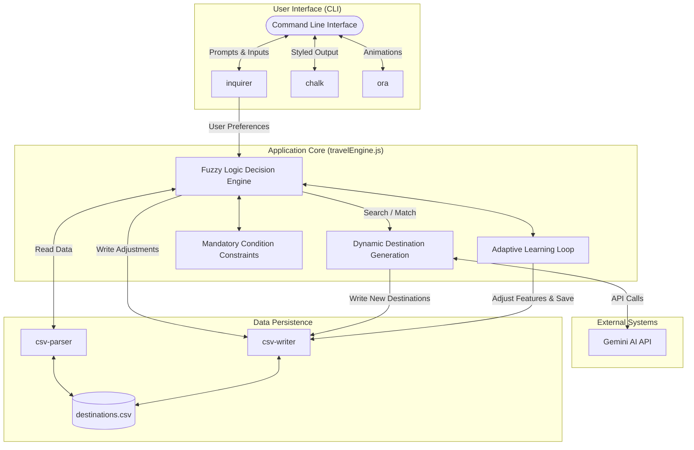
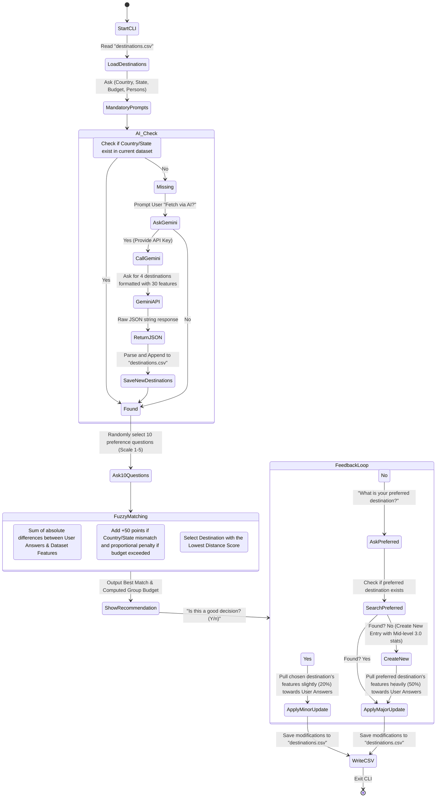

# Travel Decision Companion - Architecture & Data Flow

This document provides a high-level overview of the Travel Decision Companion application, its components, and the flow of data.

---

## 1. System Architecture

The application is built primarily with Node.js and relies on several key packages and a modular architecture.

---

## 2. Data Flow Diagram

This diagram visualizes how the system processes user inputs, performs the fuzzy logic matching, generates new data dynamically using AI, and learns from user feedback.

